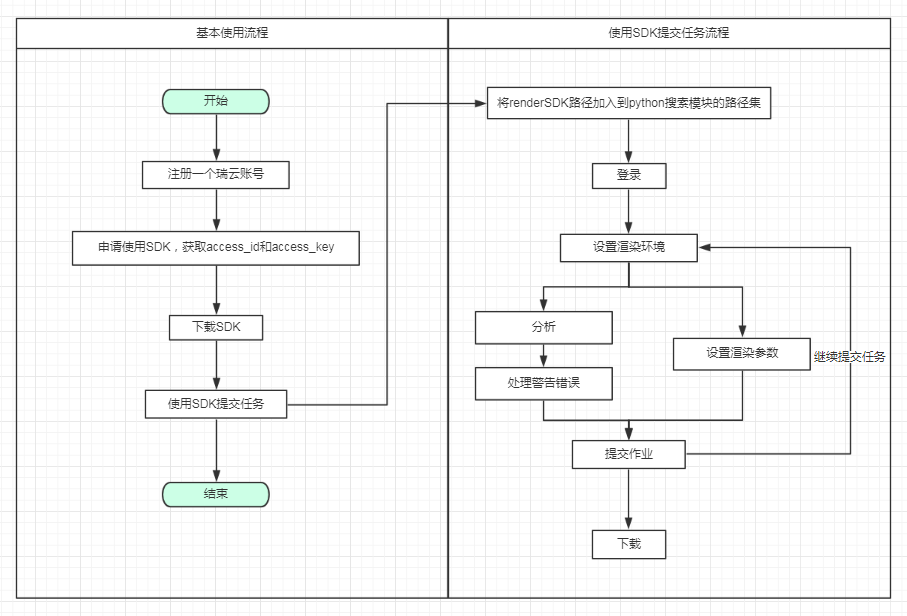

Architecture overview
=======================

This document gives a brief introduction to the Foxrenderbus SDK components.

Component
-----------

1. **rayvision_log** and **rayvision_api** are root modules, to be invoked by other modules;

2. **rayvision_utils** is a general module integrating functions to preprocessing CG configuration information calling **rayvision_api** when used;

3. **rayvision_sync** provides transport-related functions, relys on **rayvision_log** and **rayvision_api**;

4. **rayvision_maya**, **rayvision_houdini**, and **rayvision_clarisse** rely on **rayvision_utils**;

..................

- **rayvison_api**

Core module, provides a lot of interfaces to be called.

- **rayvison_utils**

Provides some common functions required by other modules, integrating necessary rendering data preprocessing and customized exception management functions.

- **rayvison_sync**

Provides transporting functions, like uploading of CG configuration files and resource files, downloading of rendering result.

- **rayvison_maya**

Provides analysis functionality for Maya resource files

- **rayvison_houdini**

Provides analysis functionality for houdini resource files

- **rayvison_clarisse**

Provides analysis functionality for clarisse resource files

flow chart
-----------

