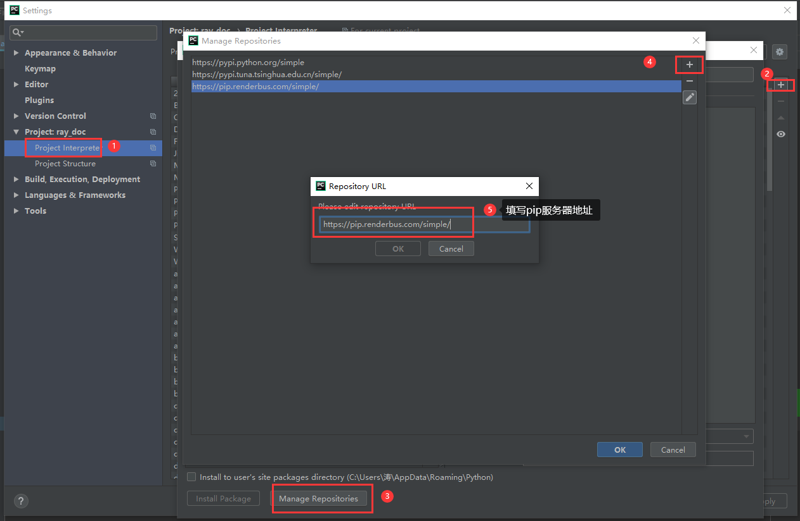
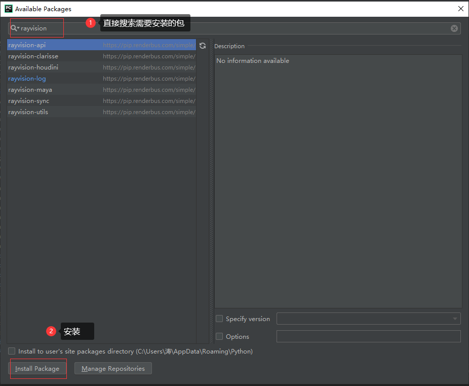

.. warning::
    Make sure local Python environment and PIP are available before use.

Installation Guide
====================

.. important::
   Before using specific rendering modules, such as Houdini rendering,
   please refer to the following installation method to install the modules in turn
   `rayvision_log`, `rayvision_api` , `rayvision_utils` , `rayvision_sync`,
   Then install `rayvision_houdini`:

   ``pip install rayvision_houdini -i https://pip.renderbus.com/simple/``

Installation method:
------------------------

**Method One (recommended):**

The rendered modules are stored in the `PIP Server <https://pip.renderbus.com/simple/>`_, use pip to install:

``pip install rayvision_log -i https://pip.renderbus.com/simple/``
``pip install rayvision_api -i https://pip.renderbus.com/simple/``
``pip install rayvision_utils -i https://pip.renderbus.com/simple/``
``pip install rayvision_sync -i https://pip.renderbus.com/simple/``

**Method Two:**

Download source code directly from GitHub:

``git clone https://github.com/renderbus/rayvision_log.git``
``git clone https://github.com/renderbus/rayvision_api.git``
``git clone https://github.com/renderbus/rayvision_utils.git``
``git clone https://github.com/renderbus/rayvision_sync.git``

*other modules are installed similarly to the secondary installation method*

**Method Three:**

* Setup IDE for PIP with address: ``https://pip.renderbus.com/simple/``

* Take pycharm as an example:

